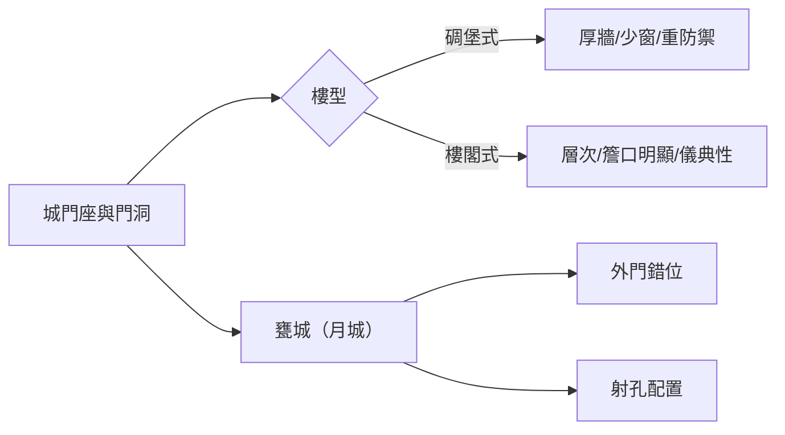

# 地方創生案例講義（補充版）
**主題：城垣、砲台與地方創生（以臺灣築城史為核心）**  
**用途**：作為你提供之講義的補充資料包，方便直接納入簡報或課堂講義。

---
## 0｜如何使用本補充檔
- ✅ 可與原講義對應章節交叉使用；本檔以「補足缺漏／加深細節／提供活動工具」為主。
- ✅ 內含可複製的活動講單、評量規準、誤解澄清卡、Mermaid 圖示與表單樣板。
- ⚠️ 城門額具地方差異；如需逐城核對，請以各縣市文資公告為準。

---
## 1｜學習目標補強（可直接貼入簡報備註）
- 能用**結構—功能—場景**三步驟口述一座城門（例：先說構件，再說防禦／通行功能，最後說社會空間）。
- 能描述**材料升級**如何改變工法與戰術（竹→土→磚／石；女兒牆與雉堞出現→射擊孔位佈局）。
- 能以**一張平面草圖**說明甕城錯位、防禦縱深與市集動線之關聯（地方創生）。
- 能運用**評估指標**規劃一條文化路徑的試營運（含觀測方式與資料倫理）。

---
## 2｜關鍵名詞補充（術語表擴充）
- **女兒牆**：屋面或城道邊緣低矮牆體，與雉堞合用提升掩蔽。
- **雉堞間隙（垛口）**：上下寬窄差形成「箭孔效應」，利視野與掩蔽兼顧。
- **護牆（內護、外護）**：甕城或城門洞兩側短牆，導引人流、限縮突入角。
- **角樓**：城牆轉角的高點樓體，視野廣、易置砲位。
- **隘口**：山隘或河道交會的狹窄要點；常見獨立式砲台或柵門。
- **磚石砌法**：常見丁順、丁字、交丁順等；影響牆體受力與抗剪性能。
- **城台（台基）**：城門樓或砲台的基壇；抬高視域並隔絕地面潮氣。
- **門釘／門鐵**：強化木門抗擊與防火；多見外層鐵皮與鉚釘規律分布。

> 小提醒：實察時可觀察**砌縫厚薄**、**轉角收邊**、**磚痕與修補層**，辨識改建。

---
## 3｜城門樓型與屋頂形式（補圖與判讀口訣）
**判讀口訣：量體→開口→屋頂→裝飾**  
1) **量體**：碉堡式厚重、開口少；樓閣式比例輕巧、層次分明。  
2) **開口**：窗門孔位與雉堞節奏是否「對齊」常可看出是否後設裝飾。  
3) **屋頂**：歇山與重簷歇山常見於官方建築；燕尾脊多見禮制／祠廟風格延伸。  
4) **裝飾**：額枋、斗拱、脊獸、吻獸等，可輔助判斷時期與工匠系統。

**Mermaid 簡圖（可貼入支援 Mermaid 的簡報）**

---
## 4｜砲台配置邏輯與類型（補充判讀與誤用排除）
- **配置與地形**：城牆轉角、河港要衝、山海隘口，優先設砲台；視距需涵蓋**交叉火網**。
- **附屬式砲台**：多為外挑平台搭配胸牆；與馬道連通，利於快速增援。
- **獨立式砲台**：平面多變（方／圓／多角）；常見**內置彈藥室**與**環形踏道**。
- **常見誤用**：觀景平台≠砲台；若無射孔、無厚牆與補給空間，傾向為後設景觀結構。

**觀察清單（現地檢核）**
- 牆厚是否顯著大於城牆平均？  
- 是否可見封堵的射孔痕跡或後期加大窗口？  
- 踏道與城道之銜接是否符合軍事邏輯（快速到位／撤離路徑）？

---
## 5｜臺灣築城史年表（材料演變補充）
> 對應你原表，以下提供「材料與工法」與「發展背景」兩欄，協助教學時串接脈絡。

| 時段 | 材料與工法重點 | 發展背景與影響 |
|---|---|---|
| 竹城期 | 竹片、竹籬圍籬，土基簡築；施工快、維護頻 | 應急防禦、聚落自保；耐久性不足 |
| 土城期 | 夯土（版築）、草泥加固；外披石礫 | 成本較低、厚重抗壓；雨蝕需保護層 |
| 磚／石期 | 青磚／紅磚、花崗石／砂岩；丁順交錯砌法 | 防禦提升、工藝成熟；彰顯官方威儀 |
| 清末強化 | 雉堞標準化、甕城錯位、砲台系統化 | 對外患（海防）與內亂（械鬥）之雙壓力 |
| 近代修護 | 咬合式修補、可逆性材料、結構加固 | 文資保存觀念與工程規範並行 |

> 旁註：同時期不同城池材料不一；以「地材可得性、財政、戰略等級」為主因。

---
## 6｜城垣與社會空間（補充案例框）
**案例框 A｜城門口＝市集邊界**
- 早晚開關城門，形成**尖離峰人流**；攤販聚集於門外廣場與橋頭。  
- 祭典或科舉時期，門額與牌坊空間成為**公共記憶場景**。

**案例框 B｜城內學—城外商**
- 官署、書院、考棚等位於城內；碼頭、作坊、旅社多在城外，**內外功能分工**明顯。

**課堂討論引導**  
- 今日城市的**捷運站出入口／交流道匝道**，與古代城門的「節點性」有何相似？

---
## 7｜從軍事設施到文化資產（操作型補充）
### 7.1 文化路徑（Heritage Trail）快速設定表
| 欄位 | 內容範例 |
|---|---|
| 路徑名稱 | 「四門八景・步行 90 分鐘」 |
| 節點 | 北門跡→甕城遺線→砲台 A→城牆保存段→舊街口→南門跡 |
| 解說層級 | 現地牌示（300字以內）＋QR 深入文（800–1200字）＋音導（2–3 分） |
| 無障礙 | 坡度≦1:12，節點設**折返替代點** |
| 互動 | AR「對位重建」（舊照疊加），「找找看」雉堞節奏任務 |

### 7.2 城門額故事化（模板）
- **象徵元素**：星象／河港／日照／山海守護等 → 對應**LOGO 圖形語彙**。  
- **文案句型**：  
  - 「以＿＿守望城北的星象，點亮旅人的方向。」（拱辰）  
  - 「讓海風與商旅的腳步，寫進城門的紋理。」（鎮海）

### 7.3 教育與博物館化（教具清單）
- 紙模／雷切木件（1:200 比例，含雉堞節奏）  
- 「甕城錯位拼圖」（磁吸式洞口可換位）  
- 互動任務卡（看圖說構件／指認砌法／找到修補痕）

### 7.4 社區參與與青創（微型專案包）
- **口述史**：長者對「過門」習俗記憶採集，轉寫語料開放授權。  
- **字體再設計**：以城額題字描摹→矢量化→字型檔測試→商品打樣。  
- **店家串聯**：「城門市集日」店章集點，換取步道限定徽章。

### 7.5 環境與韌性（工程原則）
- **可逆性**：新介入以可拆卸、不破壞原構件為先。  
- **等材料或相容材料**：優先使用**相容砂漿**與地材。  
- **雨水導排**：雉堞與胸牆增設隱藏溝槽，避免滲水劣化。

### 7.6 旅遊經濟（淡旺季策略）
- 淡季：在地學校**戶外教學**合作、志工導覽培力。  
- 旺季：**夜間光敘事**＋定點表演，對應臨時人流管理。

---
## 8｜課堂活動設計（教材可複製）
### 活動 C 作業單｜「設計你的甕城」
**任務**：在提供之城門平面草圖上完成 3 件事：  
1) 甕城形狀與外門**錯位**設計；  
2) 砲台型式（附屬／獨立）與**射孔位置**標示；  
3) 以 100 字說明如何結合**市集動線**與**導覽節點**。

**評分規準（Rubric，20 分）**  
- 防禦邏輯（8）：是否形成縱深與交叉火網。  
- 動線整合（6）：人流、導覽、攤位是否互不衝突。  
- 圖面清晰（4）：符號一致、比例合宜。  
- 說明文字（2）：條理分明、術語正確。

### 活動 D 比較表｜「城與城的差異」
| 面向 | 城 A | 城 B | 城 C | 判讀重點 |
|---|---|---|---|---|
| 材料 |  |  |  | 夯土、磚、石或混合 |
| 樓型 |  |  |  | 樓閣式／碉堡式 |
| 砲台 |  |  |  | 附屬／獨立、數量 |
| 甕城 |  |  |  | 有無錯位、平面形狀 |
| 社會空間 |  |  |  | 市集、學宮、碼頭分佈 |

> 教學技巧：給每組不同史料圖與今照，要求「找不同」後再彙整。

---
## 9｜提示與常見誤解（擴充澄清卡）
- **門洞斷面**：多見「外拱小／中段平頂／內拱或平頂」；便於吊門與防火。  
- **甕城對位**：與主門**錯位**是關鍵，不是單純加一道門。  
- **砲台視域**：僅有景觀視野不代表軍事效能；須考量**仰角／俯角／回旋空間**。  
- **修護色差**：修護後的新舊材色差屬正常；切勿以「統一色漆」覆蓋歷史訊息。  
- **「城牆一定連續一圈」**✘：殘存多為段落；應以**遺構、道路紋理、地名**補線推估。

---
## 10｜延伸思考題（加深版）
1) 若將甕城當作今日的**群眾流線閥門**，你會如何設計大型活動的安全管制？  
2) 面對都更，如何以**可逆性介入**兼顧歷史展示與無障礙？  
3) 請擇一城門額，寫一段 50–80 字品牌標語，說出其歷史寓意與今日生活連結。

---
## 11｜附錄（工具包）
### 11.1 城門額典例（教學用句型）
- 北門＝**拱辰**：以星象守望的北向意象。  
- 東門＝**昭陽**：迎日之門，象徵啟明。  
- 西門＝**鎮海**：臨海／臨河之守護。  
- 南門＝**麗正**：正大端麗，通向官署大道。  

> 註：各城額名稱不盡相同，以上為常見語彙。

### 11.2 評估指標（量化公式範例）
- **人次成長率**＝(本期入園人次－上期人次)／上期人次。  
- **導覽轉化率**＝導覽參與人次／總訪客人次。  
- **在地營收提升**＝專案期間商圈總營收－基準期平均營收。  
- **志工參與密度**＝志工總時數／開放時數。  
- **維護里程完成率**＝當期完成長度／年度計畫長度。

### 11.3 觀察記錄表（A4 範本）
| 節點 | 觀察重點 | 發現 | 佐證（照片編號／座標） | 待查問題 |
|---|---|---|---|---|
| 北門跡 | 門洞斷面、雉堞節奏 |  |  |  |
| 砲台 A | 牆厚、射孔、踏道連結 |  |  |  |
| 甕城線 | 錯位、外護牆 |  |  |  |

### 11.4 參考資料（建議蒐集方向）
- 各縣市文化資產局（處）之**指定與登錄公告**、修護報告。  
- 史地志、營造法式、工務紀錄（公文影印本）。  
- 老照片、航照圖、舊地籍圖（地政檔案）。  
- 口述史訪談（含逐字稿與授權同意）。

---
## 12｜版權與開放授權建議
- 建議以 **CC BY‑NC‑SA 4.0** 發布教案文字；圖片依原權利標示。  
- 公開資料之再利用須明確標註來源與修訂紀錄。

---
> 本補充檔與你提供之主講義相互對應：強化術語、補足流程、加入教學工具與評量規準，便於直接帶課與落地企劃。
